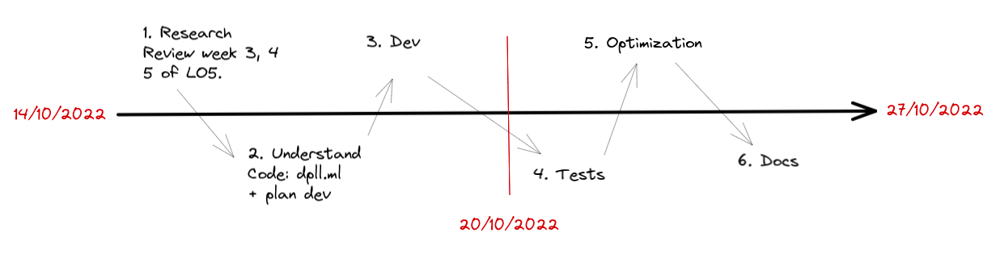

# DPLL Algorithm
>**Deadline**: 27/10/2022   
>**Last Update**: 27/10/2022   
>**Project Phase**: P7. Conclusion

- [DPLL Algorithm](#dpll-algorithm)
  - [Objective](#objective)
  - [Deliverables](#deliverables)
  - [Backlog](#backlog)
  - [Timeline](#timeline)
  - [Running/Testing the code](#runningtesting-the-code)
  - [Resources](#resources)

## Objective 
Le but du mini-projet est d'implémenter un solveur DPLL récursif en OCaml. Vous devez compléter pour cela le code dans le fichier dpll.ml

Pour plus d'informations, voir [MP1 Solveur DPLL récursif](https://moodle.u-paris.fr/mod/assign/view.php?id=366100)

## Deliverables
Fichiers à rendre: 
1. `Rendu`
2. `dimacs.ml`
3. `dpll.ml`
4. `Makefile`

## Backlog
- [x] Lectures review (focus on week 10/10)
- [x] Code Analysis
- [x] OCaml environment ([Running OCaml](https://gaufre.informatique.univ-paris-diderot.fr/letouzey/pf5/blob/master/slides/cours-03-outils.md))
- [x] Dev plan
- [x] Simplifie()
- [x] Unitatire()
- [x] Pur()
- [x] DPLL()
- [x] Documentation
  - [x] Simplifie
  - [x] Unitaire
  - [x] Pur
  - [x] DPLL
- [x] Rendu

## Timeline


## Running/Testing the code
To compile the code

```bash
> make dpll
ocamlfind ocamlopt -o dpll -package str -linkpkg dimacs.ml dpll.ml
```

```bash
# Test the code
> ./dpll examples/sudoku-9x9-easy.cnf.txt
```

```bash
# Remove compiled files
> make clean
```

## Resources
* [OCaml Overview](https://ocaml.org/docs/first-hour)
* [OCaml exercices](https://ocaml.org/problems)
